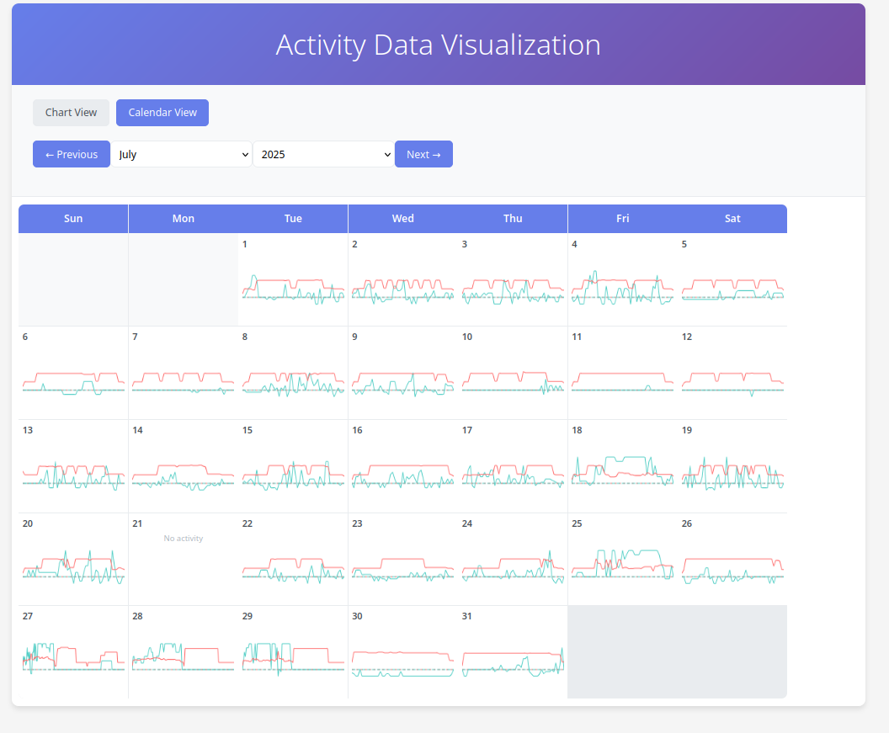
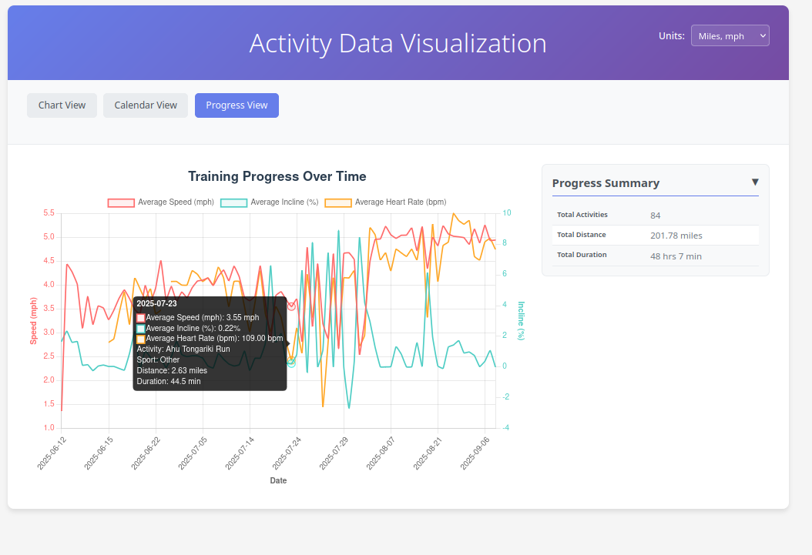

# PostgreSQL TCX Reader

## What?

I got a new treadmill. I can download
[Garmin TCX](https://en.wikipedia.org/wiki/Training_Center_XML)
files for all the workouts I've done on it.

I wanted a good way to consume and touch the data in them, and hadn't
experimented with Postgres' XML functionality before.

My treadmill in particular is a NordicTrack. TCX files are downloadable
from iFit here: https://www.ifit.com/settings/export-workouts
I've only tested this with files I got there; the XML format clearly
can do more than I am accounting for in this code.

## How?

1. Edit ```postgres_connection.sh``` to configure your postgres connection [Example database setup below]
2. Extract a pile of TCX files into a folder called "tcx"
3. Run ```create.sh```

Quick and easy database creation:
```sh
sudo su - postgres
createuser --pwprompt pgtcx
createdb -O pgtcx pgtcx
```

## Then what?

Run ```python3 app.py``` in vis





Gary <chunkyks@gmail.com>

